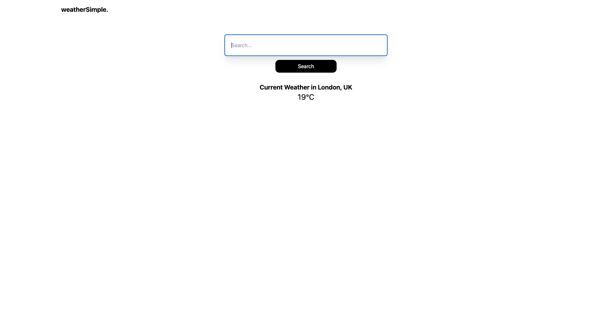
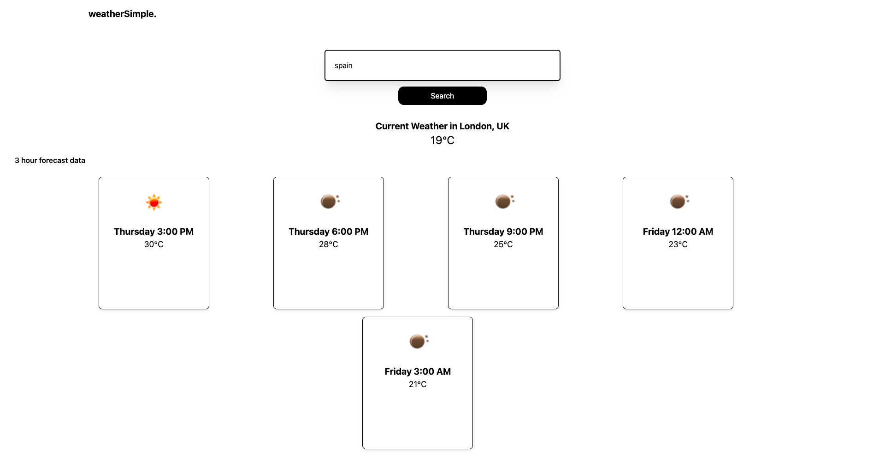
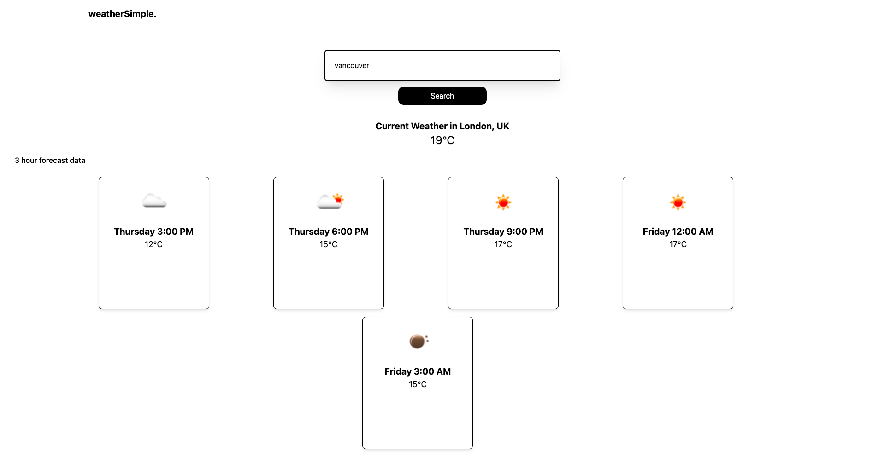

# WeatherSimple

WeatherSimple is a minimalistic weather forecasting web application that provides you with up-to-date weather information for your desired locations. It offers a clean and straightforward interface to quickly check the weather conditions and forecasts.

## Features

- **Location-Based Weather**: Enter the name of a city, and WeatherSimple will fetch the current weather and forecasts for that location.
- **Hourly Forecast**: Get a 3-hourly forecast for the upcoming 5 periods, so you can plan your day effectively.
- **Clean and Simple UI**: A user-friendly interface that presents weather data in an easy-to-understand format.

## Technologies Used

WeatherSimple is built using the following technologies:

- **React**: A JavaScript library for building user interfaces.
- **Tailwind CSS**: A utility-first CSS framework for styling the application.
- **OpenWeatherMap API**: To fetch weather data and forecasts.
- **Axios**: A promise-based HTTP client for making API requests.
- **Geocoding API**: To convert city names into latitude and longitude coordinates.

## Usage

1. Clone the repository to your local machine:

```bash
git clone https://github.com/your-username/weathersimple.git
```

2. Install the required dependencies:

```bash
cd weathersimple
npm install
```

3. Set up API keys:
   - You'll need API keys for the OpenWeatherMap API and Geocoding API. Create accounts and obtain these keys.
   - Create a `.env.local` file in the project root directory and add your API keys like this:
   - Don't worry it is already set with `.env.local` but you can use you own keys

```env
REACT_APP_OPENWEATHERMAP_API_KEY=your_openweathermap_api_key
REACT_APP_GEOCODING_API_KEY=your_geocoding_api_key
```

4. Start the development server:

```bash
npm start
```

5. Open your browser and visit `http://localhost:3000` to use WeatherSimple.

6. Screenshots

   Screenshot 1

   

   Screenshot 2

   

   Screenshot 3

   

## License

This project is licensed under the MIT License. See the [LICENSE](LICENSE) file for details.

## Acknowledgments

- Weather data provided by [OpenWeatherMap](https://openweathermap.org).
- Location data provided by [Geocoding API](https://your-geocoding-api-provider.com).

## Contributing

Contributions are welcome! Feel free to open issues and pull requests to help improve this project.

---

Feel free to modify and expand this README to fit your project's specific details and requirements. You can also include additional sections, such as "Troubleshooting," "Future Enhancements," or "Contact Information," as needed.
